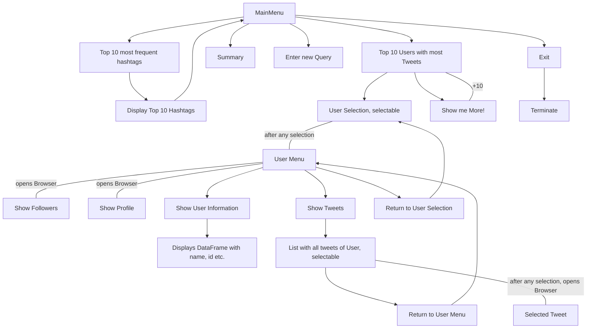

```mermaid
graph TD;
    MainMenu-->id1[Top 10 most frequent hashtags];
    id1-->id4[Display Top 10 Hashtags]
    id4-->MainMenu
    MainMenu-->id2[Top 10 Users with most Tweets];
    id2-->users[User Selection, selectable]
    id2-->more[Show me More!]
    more-- +10 ---id2
    users-- after any selection ---umenu[User Menu]
    umenu-- opens Browser ---showfollowers[Show Followers]
    umenu-- opens Browser ---showprofile[Show Profile]
    umenu-->info[Show User Information]
    umenu-->tweets[Show Tweets]
    umenu-->return[Return to User Selection]
    return-->users
    info-->df[Displays DataFrame with name, id etc.]
    tweets-->utweets[List with all tweets of User, selectable]
    utweets-->treturn[Return to User Menu]
    treturn-->umenu
    utweets-- after any selection, opens Browser ---sel[Selected Tweet]
    MainMenu-->Summary;
    MainMenu-->id3[Enter new Query];
    MainMenu-->Exit;
    Exit-->Terminate
```